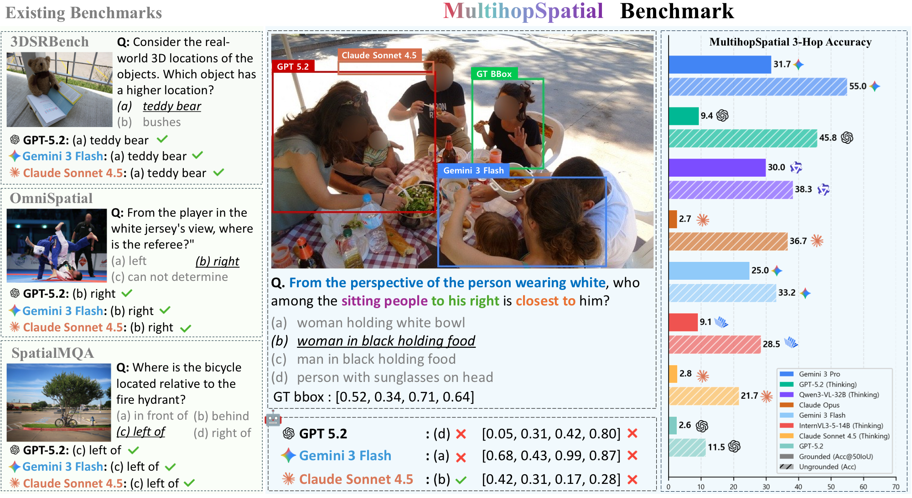

# [ECCV 2026] MultihopSpatial: Multi-hop Compositional Spatial Reasoning Benchmark for Vision-Language Models

<p align="center">
  
</p>

<p align="center">
  <a href="https://youngwanlee.github.io/multihopspatial"><b>Project Page</b></a> |
  <a href="https://arxiv.org/abs/2603.18892"><b>Paper</b></a> |
  <a href="https://huggingface.co/etri-vilab/MultiHopSpatial-Qwen3-VL-4B-Instruct"><b>Model</b></a>
</p>

> [!NOTE]
> **Contents**
> - [Overview](#overview) · [Key Features](#key-features)
> - [Model Zoo](#model-zoo) — released 4B / 8B / 32B checkpoints
> - [Benchmark](#benchmark) — [results](#results) · [reproducibility](#a-note-on-reproducibility) · [commercial APIs](#commercial-api-models-claude-gpt-gemini)
> - [Training](#training) — GRPO post-training, one command
> - [Requirements](#requirements) · [Citation](#citation) · [Acknowledgements](#acknowledgements) · [License](#license)

## Overview

**MultihopSpatial** is a benchmark designed to evaluate whether vision-language models (VLMs) demonstrate robustness in **multi-hop compositional spatial reasoning**. Unlike existing benchmarks that only assess single-step spatial relations, MultihopSpatial features queries with **1 to 3 reasoning hops** paired with **visual grounding evaluation**, exposing a critical blind spot: models achieving high multiple-choice accuracy often lack proper spatial localization.

All 4,500 benchmark QA pairs and bounding boxes are **strictly annotated by ten trained human experts** with an inter-rater agreement of 90% (Krippendorff's α = 0.90).

## Key Features

- **Multi-hop Composition**: Tests 1-hop, 2-hop, and 3-hop sequential spatial reasoning, mirroring real-world embodied AI needs.
- **Grounded Evaluation**: Addresses the "lucky guess" problem — models must both select the correct answer AND localize it via bounding box (Acc@50IoU).
- **Perspective-taking**: Includes both ego-centric and exo-centric viewpoints.
- **Three Spatial Categories**: Attribute (ATT), Position (POS), and Relation (REL), composable into multi-hop questions.
- **Training Data**: MultihopSpatial-Train (6,791 samples) supports post-training via reinforcement learning (e.g., GRPO).

## Model Zoo

GRPO post-trained on MultihopSpatial-Train. All three are drop-in replacements for
their Qwen3-VL base model.

| Model | Base | Download |
|---|---|---|
| MultiHopSpatial-Qwen3-VL-4B-Instruct | Qwen3-VL-4B-Instruct | <a href="https://huggingface.co/etri-vilab/MultiHopSpatial-Qwen3-VL-4B-Instruct"> weight</a> |
| MultiHopSpatial-Qwen3-VL-8B-Instruct | Qwen3-VL-8B-Instruct | <a href="https://huggingface.co/etri-vilab/MultiHopSpatial-Qwen3-VL-8B-Instruct"> weight</a> |
| MultiHopSpatial-Qwen3-VL-32B-Instruct | Qwen3-VL-32B-Instruct | <a href="https://huggingface.co/etri-vilab/MultiHopSpatial-Qwen3-VL-32B-Instruct"> weight</a> |

The benchmark itself lives at
<a href="https://huggingface.co/datasets/etri-vilab/MultihopSpatial"> dataset</a>
— 4,500 test samples and 6,791 training samples, images included.

## Benchmark

Evaluation code is in [`eval/`](eval/). Both scripts auto-download the test set (JSON + 6,493 images) from the [HF dataset](https://huggingface.co/datasets/etri-vilab/MultihopSpatial) and the model checkpoint from the [HF Hub](https://huggingface.co/etri-vilab/MultiHopSpatial-Qwen3-VL-4B-Instruct) on first run — no manual data setup needed.

```bash
pip install -r requirements.txt
cd eval

# Fast path: vLLM batched inference (recommended)
python benchmark_qwen_vllm.py --output results_qwen3vl_4b

# Plain transformers inference (no vLLM dependency, slower)
python benchmark_qwen.py --output results_qwen3vl_4b.json

# Quick smoke test on 5 samples
python benchmark_qwen_vllm.py --test_samples 5

# Multi-GPU tensor parallelism (e.g. for larger checkpoints)
python benchmark_qwen_vllm.py --model_path /path/to/checkpoint --gpus 0,1,2,3,4,5,6,7 --max_model_len 32768
```

`--model_path` accepts any HF Hub repo id or local checkpoint path, so you can point it at any of our released model sizes (or your own checkpoint, or a local path):

```bash
# 4B
python benchmark_qwen_vllm.py --model_path etri-vilab/MultiHopSpatial-Qwen3-VL-4B-Instruct

# 8B
python benchmark_qwen_vllm.py --model_path etri-vilab/MultiHopSpatial-Qwen3-VL-8B-Instruct

# 32B (needs multi-GPU tensor parallelism)
python benchmark_qwen_vllm.py --model_path etri-vilab/MultiHopSpatial-Qwen3-VL-32B-Instruct \
    --gpus 0,1,2,3,4,5,6,7 --max_model_len 32768
```

### Results

Each script reports overall **MCQ Accuracy**, **Acc@50IoU**, and **Average IoU**, plus a per-hop/per-view breakdown. Reproduced numbers on the full 4,500-sample test set, independently verified against the paper (4B/8B/32B numbers appear in the camera-ready version):

| Model | Source | MCQ Acc | Acc@50IoU | Avg IoU |
|---|---|---|---|---|
| 4B-Instruct | Paper | 62.9 | 53.8 | 72.6 |
| 4B-Instruct | Reproduced (vLLM, greedy) | 63.31 / 63.49 (2 runs) | 54.29 / 54.36 | 72.63 / 72.57 |
| 4B-Instruct | Reproduced (transformers, greedy) | 63.47 | 54.27 | 72.38 |
| 8B-Instruct | Paper | 61.02 | 51.53 | 71.71 |
| 8B-Instruct | Reproduced (vLLM) | 61.49 | 52.07 | 71.79 |
| 32B-Instruct | Paper | 67.22 | 56.87 | 72.01 |
| 32B-Instruct | Reproduced (vLLM) | 67.42 | 57.22 | 72.14 |

### A note on reproducibility

> [!IMPORTANT]
> Small run-to-run differences (usually well under 1 point) are expected and **not a
> bug** — even with `--greedy` decoding. Two independent vLLM runs against the same
> checkpoint and data above differed by ~0.2 points despite identical settings.

<details>
<summary><b>Why greedy decoding still varies between runs</b></summary>

<br>

It comes from GPU floating-point non-determinism, not randomness in the decoding strategy itself:

- **Kernel-level non-determinism**: matmul/attention reductions on GPU don't have a fixed summation order by default, so the same computation can produce logits that differ in the last few bits between runs (kernel/algorithm selection, thread scheduling). Usually invisible, but when two candidate tokens have near-tied logits, that tiny jitter can flip which one "wins" under argmax.
- **Batching effects (vLLM specifically)**: continuous batching means a request's numerical result can depend slightly on what other sequences happen to be batched alongside it — attention kernel tiling/padding differs by batch composition. The same prompt run twice isn't guaranteed byte-identical output.
- **Compounding over long generations**: this is autoregressive, so one flipped token early on changes the context for every token after it — a single borderline argmax flip can change the final MCQ answer, not just cause a rounding-level difference.

Given the test set has 4,500 samples, a handful of borderline flips easily explains the observed variance. If you need bit-exact reproducibility, you'd need `torch.use_deterministic_algorithms(True)`, a fixed batch size, and disabling FlashAttention's non-deterministic paths — at a real performance cost, and not something this benchmark's numbers depend on.

Also note: the 8B/32B numbers above used the checkpoints' own `generation_config.json` sampling settings (temperature=0.7, unseeded) rather than `--greedy`, matching how they were originally evaluated — so slightly larger run-to-run variance is expected for those than for the greedy 4B numbers.

</details>

### Commercial API models (Claude, GPT, Gemini)

`eval/benchmark_claude.py`, `eval/benchmark_gpt.py`, and `eval/benchmark_gemini.py` evaluate closed-source models the same way — auto-downloading the dataset, no manual setup. Each reads its API key from an environment variable and exits with a clear error (plus a signup link) if it isn't set; see the header comment in each script for provider-specific notes.

```bash
export ANTHROPIC_API_KEY="sk-ant-..."   # benchmark_claude.py — https://console.anthropic.com/
export OPENAI_API_KEY="sk-..."          # benchmark_gpt.py    — https://platform.openai.com/
export GEMINI_API_KEY="AIza..."         # benchmark_gemini.py — https://aistudio.google.com/

cd eval
python benchmark_claude.py --test_samples 5
python benchmark_gpt.py --model gpt-5.2 --test_samples 5
python benchmark_gemini.py --model gemini-3-flash-preview --test_samples 5
```


## Training

Training code is in [`train/`](train/) — GRPO post-training of Qwen3-VL on the
MultihopSpatial train split (6,791 samples), the recipe behind the released
checkpoints. Like the evaluation scripts, it auto-downloads the dataset and base
model, so there's no manual data setup.

```bash
pip install -r train/requirements.txt
cd train
bash train_grpo_qwen3vl_4b.sh     # or _8b / _32b
```

That single command downloads the dataset and base model, converts the data,
trains (8 GPUs, 10 epochs, lr 5e-5), and merges the result into a standalone
checkpoint. All three released sizes share the same recipe.

GRPO optimizes `format + α·mcq + β·bbox + γ·truncation` (all coefficients default
to 1.0) over LoRA adapters on the language model, with the base weights frozen.
Training ends by merging the adapters into a standalone checkpoint at
`output/<run-name>/merged`, which you can hand straight to the eval scripts.

> [!TIP]
> See [`train/README.md`](train/README.md) for the full configuration, the reward
> breakdown, how to resume an interrupted run, and where the dataset and base model
> get cached.

## Requirements

Install everything with `pip install -r requirements.txt` (training additionally
needs `pip install -r train/requirements.txt`).

<details>
<summary><b>Verified library versions</b></summary>

<br>

Verified on CUDA 12.8; training on 8x A100 80GB.

| Library | Version | Needed for |
|---|---|---|
| torch | 2.8.0 | everything |
| torchvision | 0.23.0 | everything |
| transformers | 4.57.0 | everything |
| accelerate | 1.6.0 | everything |
| huggingface_hub | 0.36.2 | everything |
| qwen-vl-utils | 0.0.14 | everything |
| pillow | 12.1.1 | everything |
| tqdm | 4.67.3 | everything |
| vllm | 0.11.0 | `benchmark_qwen_vllm.py` |
| anthropic | 0.85.0 | `benchmark_claude.py` |
| openai | 2.24.0 | `benchmark_gpt.py` |
| google-genai | 1.73.1 | `benchmark_gemini.py` |
| trl | 0.23.1 | training |
| peft | 0.16.0 | training |
| deepspeed | 0.18.6 | training |
| datasets | 4.5.0 | training |
| flash-attn | 2.7.2.post1 | optional, see below |

flash-attn is optional but makes the transformers backend faster and lighter on
memory. Install it last, after everything else, since it builds against the torch
you just installed:

```bash
pip install flash-attn==2.7.2.post1 --no-build-isolation
```

</details>

## Citation
```bibtex
@inproceedings{lee2026multihopspatial,
  title={MultihopSpatial: Multi-hop Compositional Spatial Reasoning Benchmark for Vision-Language Models},
  author={Lee, Youngwan and Jang, Soojin and Cho, Yoorhim and Lee, Seunghwan and Lee, Yong-Ju and Hwang, Sung Ju},
  booktitle={European Conference on Computer Vision (ECCV)},
  year={2026}
}
```

## Acknowledgements

This work was supported by Institute of Information & communications Technology
Planning & Evaluation (IITP) grant funded by the Korea government (MSIT)
(No. 2022-0-00871, Development of AI Autonomy and Knowledge Enhancement for AI
Agent Collaboration, 90%) and (No. 2019-0-00075, Artificial Intelligence Graduate
School Program (KAIST), 10%).

Our code builds on the following open-source projects, and we thank their authors:

- [Qwen-VL-Series-Finetune](https://github.com/2U1/Qwen-VL-Series-Finetune) — the training pipeline our SFT/DPO/GRPO code is based on.
- [Qwen3-VL](https://github.com/qwenlm/qwen3-vl) — the base vision-language models.
- [TRL](https://github.com/huggingface/trl) — the GRPO trainer our training code extends.

## License

Released under the [Apache License 2.0](LICENSE).
